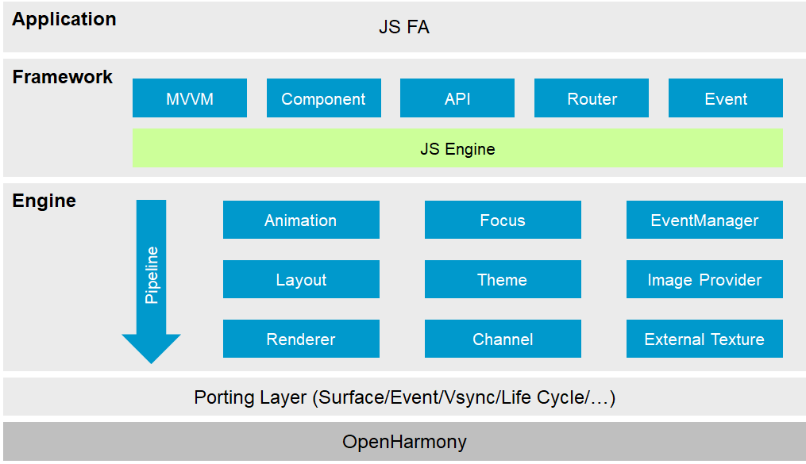

# JS UI框架概述

-   [基础能力](#section1393616301083)
-   [整体架构](#section105231413161115)

JS UI框架是一种跨设备的高性能UI开发框架，支持类Web范式编程和跨设备多态UI。

阅读本开发指南前，开发者需要掌握以下基础知识：

-   HTML5
-   CSS
-   JavaScript

## 基础能力

-   **类Web范式编程**

    JS UI框架采用类HTML和CSS Web编程语言作为页面布局和页面样式的开发语言，页面业务逻辑则支持ECMAScript规范的JavaScript语言。JS UI框架提供的类Web编程范式，可以让开发者避免编写UI状态切换的代码，视图配置信息更加直观。

-   **跨设备**

    开发框架架构上支持UI跨设备显示能力，运行时自动映射到不同设备类型，开发者无感知，降低开发者多设备适配成本。

-   **高性能**

    开发框架包含了许多核心的控件，如列表、图片和各类容器组件等，针对声明式语法进行了渲染流程的优化。

## 整体架构

JS UI框架包括应用层（Application）、前端框架层（Framework）、引擎层（Engine）和平台适配层（Porting Layer）。

-   **Application**

    应用层表示开发者使用JS UI框架开发的FA应用，这里的FA应用特指JS FA应用。

-   **Framework**

    前端框架层主要完成前端页面解析，以及提供MVVM（Model-View-ViewModel）开发模式、页面路由机制和自定义组件等能力。

-   **Engine**

    引擎层主要提供动画解析、DOM（Document Object Model）树构建、布局计算、渲染命令构建与绘制、事件管理等能力。

-   **Porting Layer**

    适配层主要完成对平台层进行抽象，提供抽象接口，可以对接到系统平台。比如：事件对接、渲染管线对接和系统生命周期对接等。

