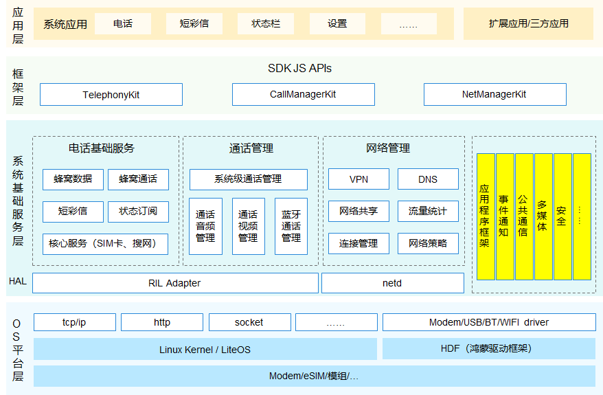

# 电话服务子系统<a name="ZH-CN_TOPIC_0000001162422291"></a>

-   [简介](#section104mcpsimp)
-   [目录](#section119mcpsimp)
-   [约束](#section123mcpsimp)
-   [使用说明](#section128mcpsimp)
    -   [获取当前蜂窝网络信号信息](#section1458213210369)
    -   [观察蜂窝网络状态变化](#section750135512369)

-   [相关仓](#section152mcpsimp)

## 简介<a name="section104mcpsimp"></a>

电话服务子系统，提供了一系列的API用于获取无线蜂窝网络和SIM卡相关的一些信息。应用可以通过调用API来获取当前注册网络名称、网络服务状态、信号强度以及SIM卡的相关信息。

各个模块主要作用如下：

-   核心服务模块：主要功能是初始化RIL管理、SIM卡和搜网模块，以及获取RIL Adapter服务。
-   RIL Adapter模块：主要功能是厂商库加载，业务接口实现以及事件调度管理。
-   通话管理模块：主要功能是管理CS（Circuit Switch，电路交换）、IMS（IP Multimedia Subsystem，IP多媒体子系统）和OTT（over the top，OTT解决方案）三种类型的通话，申请通话所需要的音视频资源，处理多路通话时产生的各种冲突。
-   蜂窝通话模块：主要功能是实现基于运营商网络的基础通话。
-   蜂窝数据模块：主要功能是蜂窝数据激活、蜂窝数据异常检测与恢复、蜂窝数据状态管理等。
-   短彩信模块：主要功能是短信收发和彩信编解码。
-   状态注册模块：主要功能是提供电话服务子系统各种消息事件的订阅以及取消订阅的API。

**图 1**   子系统架构图



## 目录<a name="section119mcpsimp"></a>

```
base/telephony/
├── core_service            # 核心服务
├── ril_adapter             # RIL Adapter
├── call_manager            # 通话管理
├── cellular_call           # 蜂窝通话
├── cellular_data           # 蜂窝数据
├── sms_mms                 # 短彩信
└── state_registry          # 状态注册
```

## 约束<a name="section123mcpsimp"></a>

1.  注册获取SIM卡状态接口仅针对有SIM卡在位场景生效，若用户拔出SIM卡，则接收不到回调事件。应用可通过调用getSimState接口来确定当前卡槽是否有卡在位。
2.  拨打电话和发送短信API现阶段仅供系统应用使用，暂不支持三方应用申请调用。
3.  目前开源的范围仅支持蜂窝通话（仅支持CS通话）和短信，不支持蜂窝数据上网，仅支持单SIM卡。

## 使用说明<a name="section128mcpsimp"></a>

### 获取当前蜂窝网络信号信息<a name="section1458213210369"></a>

1.  从@ohos.telephony.radio.d.ts中导入radio命名空间。
2.  可以通过callback或者Promise的方式调用getSignalInformation\(slotId: number\)方法。
3.  该接口为异步接口，结果会从callback中返回SignalInformation数组。
4.  遍历SignalInformation数组，获取不同制式（signalType）的信号强度（signalLevel）。

    ```
    // 引入包名
    import radio from "@ohos.telephony.radio";
    
    // 参数赋值
    let slotId = 1;
    
    // 调用接口【callback方式】
    radio.getSignalInformation(slotId, (err, value) => {
      if (err) {
        // 接口调用失败，err非空
        console.error(`failed to getSignalInformation because ${err.message}`);
        return;
      }
      // 接口调用成功，err为空
      for (let i = 0; i < value.length; i++) {
        console.log(`success to getSignalInformation: type is ${value[i].signalType}, level is ${value[i].signalLevel}`);
      }
    });
    
    // 调用接口【Promise方式】
    let promise = radio.getSignalInformation(slotId);
    promise.then((value) => {
      // 接口调用成功，此处可以实现成功场景分支代码。
      for (let i = 0; i < value.length; i++) {
        console.log(`success to getSignalInformation: type is ${value[i].signalType}, level is ${value[i].signalLevel}`);
      }
    }).catch((err) => {
      // 接口调用失败，此处可以实现失败场景分支代码。
      console.error(`failed to getSignalInformation because ${err.message}`);
    });
    ```


### 观察蜂窝网络状态变化<a name="section750135512369"></a>

**添加观察事件**

1.  从@ohos.telephony.observer.d.ts中导入observer命名空间。
2.  调用on\(type: 'networkStateChange'\)方法，传入卡槽id（slotId）和收到事件的回调处理函数（callback），其中slotId为可选参数。
3.  当网络状态发生变更时，调用者会收到回调。

    ```
    // 引入包名
    import observer from '@ohos.telephony.observer';
    
    // 开启订阅
    observer.on('networkStateChange', {slotId: 1}, (err, value) => {
      if (err) {
        // 接口调用失败，err非空
        console.error(`failed, because ${err.message}`);
        return;
      }
      // 接口调用成功，err为空
      console.log(`success on. network state is ` + value);
    });
    ```


**停止观察**

1.  从@ohos.telephony.observer.d.ts中导入observer命名空间。
2.  调用off\(type: 'networkStateChange'\)方法，传入添加观察事件时的callback对象。

    ```
    // 引入包名
    import observer from '@ohos.telephony.observer';
    
    // 关闭订阅
    observer.off('networkStateChange', (err, value) => {
      if (err) {
        // 接口调用失败，err非空
        console.error(`failed, because ${err.message}`);
        return;
      }
      // 接口调用成功，err为空
      console.log(`success off`);
    });
    ```


## 相关仓<a name="section152mcpsimp"></a>

**电话服务子系统**

telephony\_core\_service

telephony\_ril\_adapter

telephony\_call\_manager

telephony\_cellular\_call

telephony\_cellular\_data

telephony\_sms\_mms

telephony\_state\_registry

